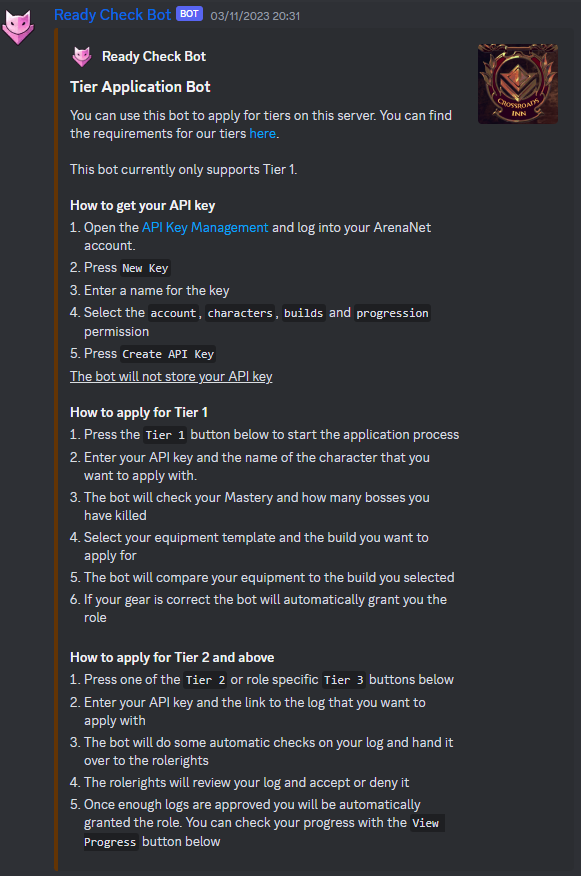
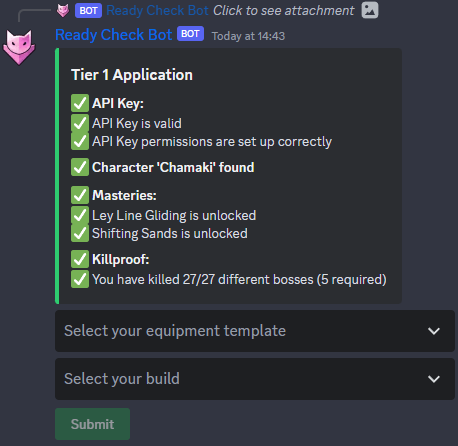
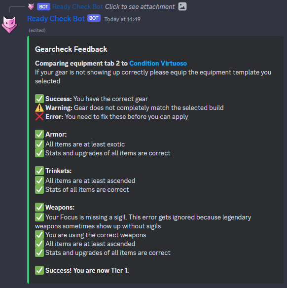
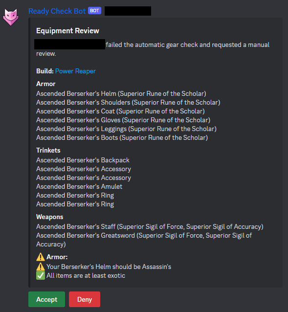

# The Crossrods Inn - Ready Check Bot
This is a Discord bot that allows trainees to apply for tiers in [The Crossroads Inn](https://discord.gg/hdhDE3v). 
It is written in Python and uses the discord.py library.

The bot uses the Guild Wars 2 API to check if a user has the required achievements, mastery and equipment for a tier.
The equipment is checked by comparing the user's equipment with the suggested equipment from [Snow Crows](https://snowcrows.com/en/home).
In case the user's equipment differs from the suggested equipment, a manual gear check can be requested.

As of the latest update, the bot also supports automatic log checks. 
Users can submit their logs and the bot will check if the logs meet the requirements for the tier they are applying for.
Administrators can define the mechanics for each boss and the bot will check if the logs meet the requirements.

## Setup with `docker compose`
Add the missing environment variables to the `docker-compose.yml` file and run `docker-compose up -d`.

## Environment variables
| Variable | Description                                                                    |
|----------|--------------------------------------------------------------------------------|
| `DISCORD_TOKEN` | The bot token from the Discord developer portal.                               |
| `DATABASE_URL` | The URL of the database.                                                       |

## Config values

Before using the bot, you need to set the following values with the `/config` command. 
Using the `/config init` command will set the default values for The Crossroads Inn. 

| Variable | Description                                                                        |
|----------|------------------------------------------------------------------------------------|
| `T0_ROLE_ID` | The ID of the role for tier 0.                                                     |
| `T1_ROLE_ID` | The ID of the role for tier 1.                                                     |
| `T2_ROLE_ID` | The ID of the role for tier 2.                                                     |
| `T3_ROLE_ID` | The ID of the role for tier 3.                                                     |
| `POWER_DPS_ROLE_ID` | The ID of the role for tier 3 power DPS.                                           |
| `CONDITION_DPS_ROLE_ID` | The ID of the role for tier 3 condition DPS.                                       |
| `HEAL_ROLE_ID` | The ID of the role for tier 3 healers.                                             |
| `BOON_DPS_ROLE_ID` | The ID of the role for tier 3 boon DPS.                                            |
| `LOG_CHANNEL_ID` | The ID of the channel where the bot should log.                                    |
| `GEAR_REVIEW_CHANNEL_ID` | The ID of the channel where the manual gear checks are posted.                     |
| `LOG_REVIEW_CHANNEL_ID` | The ID of the channel where the logs are posted for review.                        |
| `TIER_ASSIGNMENT_CHANNEL_ID` | The ID of the channel where the bot should post the tier assignments messages.     |
| `MIN_GW2_BUILD` | The minimum build version required for the bot to check the user's equipment.      |
| `MAX_SQUAD_DOWNS` | The maximum amount of downs in the squad allowed to pass the automatic log check.  |
| `MAX_SQUAD_DEATHS` | The maximum amount of deaths in the squad allowed to pass the automatic log check. |
| `MAX_PLAYER_DOWNS` | The maximum amount of downs of the player allowed to pass the automatic log check. |

## Screenshots

#### How to use:

#### Achievements & Mastery Check:

#### Automatic Equipment Review:

#### Manual Equipment Review:
